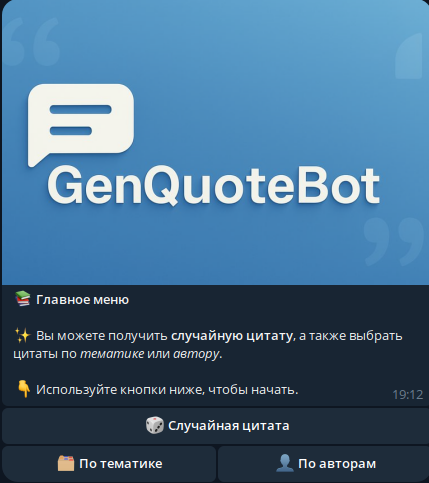
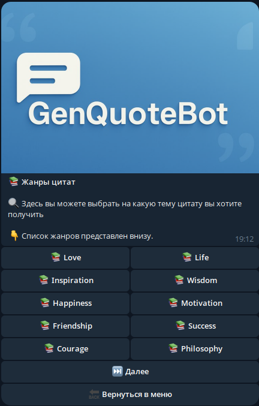
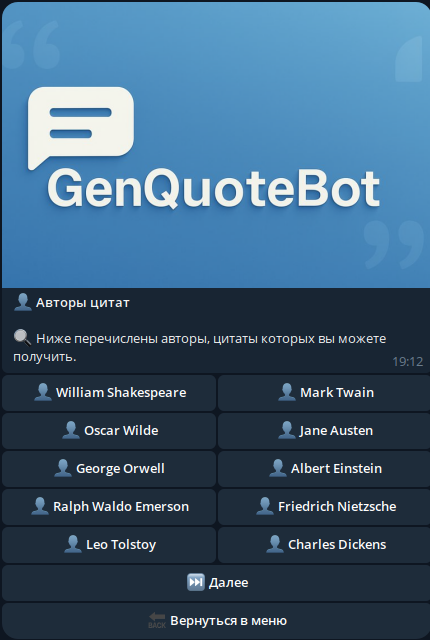
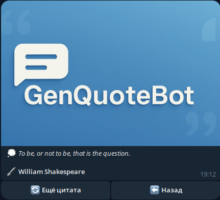

# GenQuoteBot

**GenQuoteBot** — это Telegram-бот, который генерирует случайные цитаты и позволяет выбирать их по жанру или автору.
Бот построен на многоуровневом меню через редактирование текущего сообщения, что позволяет работать с ботом в одном сообщении не "захламляя" переписку.

---
## Описание функционала

- `/start` — выводит главное меню.
- 🎲 **Случайная цитата** — бот присылает одну случайную цитату.
- 🗂️ **По тематике** — выбор темы (жанра), получение цитаты этой темы и кнопка «Ещё цитата».
- 👤 **По авторам** — выбор автора, получение цитаты этого автора и кнопка «Ещё цитата».

---
|               Главное меню               |              Список жанров              |
|:----------------------------------------:|:---------------------------------------:|
|   |  |
|              Список авторов              |             Страница цитаты             |
|  |  |
---
## MVP: «Генератор случайных цитат»

Ниже описано, как устроен бот с цитатами и как быстро начать им пользоваться:

1. **Источник цитат**  
   Все данные берутся из публичного API [QuotesDB](https://quotes-db.vercel.app):
   - `GET https://quotes-db.vercel.app/api/quotes` — все цитаты.
   - `GET https://quotes-db.vercel.app/api/quotes?category=<genre>` — случайная цитата по указанной теме.
   - `GET https://quotes-db.vercel.app/api/categories` — список жанров.
   - `GET https://quotes-db.vercel.app/api/authors` — список авторов.  
   Подробнее: https://quotes-db.vercel.app/

2. **Формат ответа**  
   API возвращает JSON. Пример одной цитаты:
   ```json
   {
     "id": 123,
     "quote": "To be or not to be...",
     "author": "William Shakespeare",
     "category": "philosophy"
   }
   ```

3. **Использование в коде**  
   В `data/get_quotes_api.py` доступны функции:
   ```python
   await get_random_quote()                # случайная цитата
   await get_quotes_by_category(category)  # цитата по жанру
   await get_quotes_by_author(author)      # цитата по автору
   await get_topics()                      # список жанров
   await get_authors(page, limit)         # список авторов
   ```
   Требуемые библиотеки:
   - `aiohttp` — асинхронные HTTP-запросы.
   - `asyncio` — асинхронное выполнение задач в Python.
   - `python-dotenv` - хранение чувствительных данных (токены и тп)


4. **Полезные ссылки и туториалы**  
   - [Документация aiogram](https://docs.aiogram.dev)  
   - [python-dotenv](https://github.com/theskumar/python-dotenv)

---

## Запуск локально

1. **Клонировать репозиторий**
   ```bash
   git clone https://github.com/mishkintsev/GenQuoteBot.git
   cd GenQuoteBot
   ```

2. **Создать виртуальное окружение и активировать**
   ```bash
   python3 -m venv venv
   source venv/bin/activate
   ```

3. **Установить зависимости**
   ```bash
   pip install -r requirements.txt
   ```

4. **Создать файл `.env`** и добавить:
   ```dotenv
   TG_TOKEN=<ваш_токен_бота>
   GA4_MEASUREMENT_ID=G-XXXXXXXXXX
   GA4_API_SECRET=<ваш_API_Secret>
   ```

5. **Запустить бота**
   ```bash
   python bot.py
   ```

После запуска отправьте `/start` в Telegram и получите главное меню с кнопками для цитат.

---

## Интеграция «новинки»

- Полный отчёт об интеграции и мотивации выбора Google Analytics в [ANALYTICS.md](README_ANALYTICS.md).


## Дополнительные идеи по функционалу бота

- Описание новых идей для сервиса [Дополнительные идеи](README_IDEAS.md)


## План развития

- [План профессионального развития на 3 месяца](README_EDU.md)